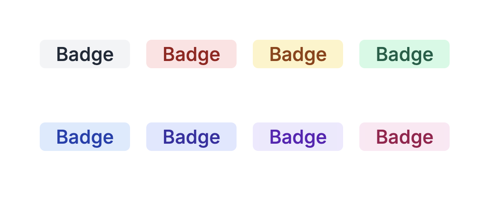
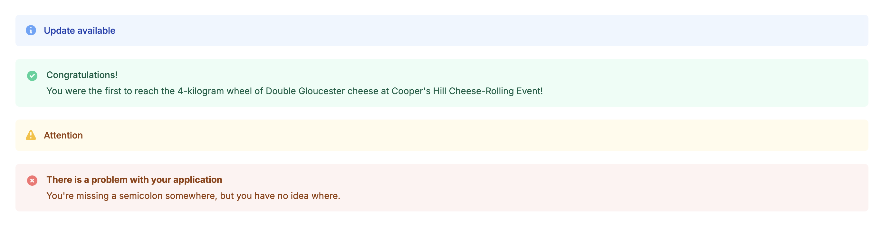
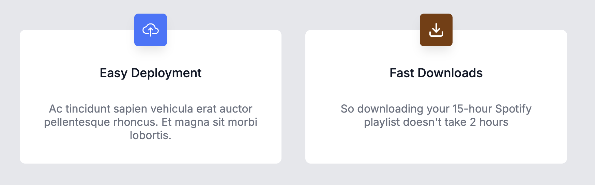
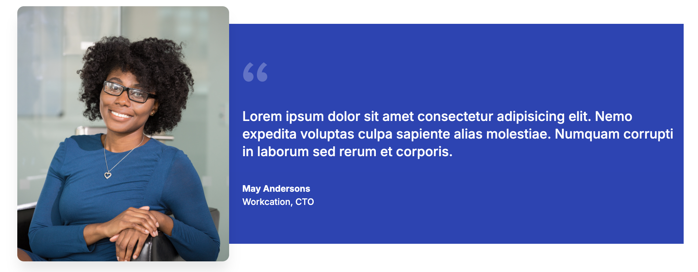
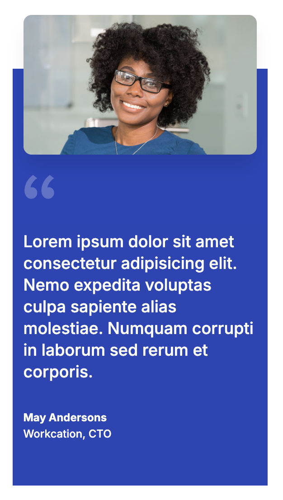

# React Component Library

A collection of reusable React UI components built as part of a React course project.

The library includes customizable badges, banners, cards, and testimonials. Components are designed to be reusable, configurable through props, and styled using CSS.

## Components

- Badge
- Banner
- Card
- Testimonial

## Screenshots

### Badge Component



### Banner Component



### Card Component



### Testimonial Without Image Component


### Testimonial With Image Component




## Badge

A small label used to highlight status, categories, or metadata.

### Props

| Prop | Type | Default | Description |
|--------|------|---------|-------------|
| color | string | "gray" | Controls badge color |
| shape | string | "square" | square or pill |
| children | ReactNode | - | Badge content |

### Example

```jsx
<Badge color="green" shape="pill">
    Success
</Badge>
```

## Banner

Displays an informational message to the user with a predefined status type and corresponding icon.

The Banner component supports four message types: neutral, success, warning, and error. Each type automatically renders an appropriate heading, icon, and styling.

### Props

| Prop       | Type      | Default     | Description                                                                                     |
| ---------- | --------- | ----------- | ----------------------------------------------------------------------------------------------- |
| `type`     | string    | `"neutral"` | Controls the banner variant. Supported values: `"neutral"`, `"success"`, `"warning"`, `"error"` |
| `children` | ReactNode | -           | Optional message content displayed beneath the heading                                          |

### Variants

| Type      | Heading                                  |
| --------- | ---------------------------------------- |
| `neutral` | Update available                         |
| `success` | Congratulations!                         |
| `warning` | Attention                                |
| `error`   | There is a problem with your application |

### Examples

#### Neutral Banner

```jsx
<Banner>
    A new software update is available.
</Banner>
```

#### Success Banner

```jsx
<Banner type="success">
    Your profile has been updated successfully.
</Banner>
```

#### Warning Banner

```jsx
<Banner type="warning">
    Your subscription will expire in 7 days.
</Banner>
```

#### Error Banner

```jsx
<Banner type="error">
    We were unable to process your request.
</Banner>
```

### Notes

* An icon is automatically displayed based on the selected banner type.
* If no `children` are provided, only the heading is rendered.
* Styling is controlled through variant-specific CSS classes applied to the root banner element.

## Card

A flexible content container used to group related information.

### Props

| Prop | Type | Default | Description |
|--------|------|---------|-------------|
| icon | ReactNode | Upload icon | Icon displayed at the top of the card |
| iconColor | string | "#3F75FE" | The icon's background color |
| title | string | "Easy Deployment" | Card heading |
| children | ReactNode | - | Card body content |

### Example

```jsx
<Card
    icon={<IoCloudUploadOutline />}
    title="Easy Deployment"
>
    Ac tincidunt sapien vehicula erat auctor pellentesque rhoncus.
</Card>
```

## TestimonialWithoutImage

Displays a customer testimonial alongside company branding.

### Props

| Prop | Type | Default | Description |
|--------|------|---------|-------------|
| companyName | string | "Workcation" | Name of the company |
| companyLogo | ReactNode | Default logo | Company logo image |
| personName | string | "May Anderson" | Name of the person giving the testimonial |
| personRole | string | "CTO" | Person's role or title |
| layout | string | "desktop" | Controls the layout of the testimonial. Supported values: "desktop", "mobile" |
| children | ReactNode | - | Testimonial text |

### Example

```jsx
<TestimonialWithoutImage
    companyName="Acme Inc."
    personName="Jane Doe"
    personRole="Engineering Manager"
>
    This product has significantly improved our team's productivity.
</TestimonialWithoutImage>
```

## TestimonialWithImage

Displays a customer testimonial alongside company branding.

### Props

| Prop | Type | Default | Description |
|--------|------|---------|-------------|
| photo | ReactNode | Default photo | Photo of the person giving the testimonial |
| companyName | string | "Workcation" | Name of the company |
| companyLogo | ReactNode | Default logo | Company logo image |
| personName | string | "May Anderson" | Name of the person giving the testimonial |
| personRole | string | "CTO" | Person's role or title |
| layout | string | "desktop" | Controls the layout of the testimonial. Supported values: "desktop", "mobile" |
| children | ReactNode | - | Testimonial text |

### Example

```jsx
<TestimonialWithImage
    companyName="Acme Inc."
    personName="Jane Doe"
    personRole="Engineering Manager"
>
    This product has significantly improved our team's productivity.
</TestimonialWithImage>
```

## Running the Project
- Clone the repository: `git clone https://github.com/emmadillpickle/component-library.git`
- Navigate to the project directory: `cd component-library`
- Install dependencies: `npm install`
- Start the development server: `npm run dev` or `npm start` depending on your project setup.

## Learning Objectives

This project was created to practice:

- Reusable UI design
- Component composition
- Props and default props
- Conditional rendering
- CSS styling techniques
- Building scalable React components

## Technologies

- React
- JavaScript
- CSS
- Vite